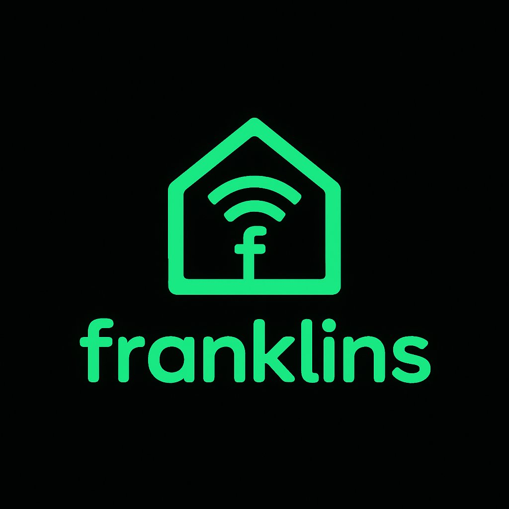

# franklins-dash

A clean, minimal dashboard for Home Assistant — designed for wall-mounted tablets.



## What it does

Replaces the Lovelace UI with a simple, touch-friendly interface. HA runs headless as the backend; franklins-dash is the only thing your household sees.

```
[Tablet / Kiosk Browser] → [RPi: Flask] → [HA WebSocket API] → [Devices]
```

**Features:**
- Room-based layout with groups (sidebar navigation)
- Switches, dimmers, covers, sensors, scenes, climate control
- Cover control with open/stop/close buttons and position slider
- Climate modal with target temperature, slider, and mode control
- Scenes (one-tap activation) and toggles (input_boolean, automation)
- Real-time state updates via WebSocket
- Auto dark/light theme (configurable: auto, dark, light)
- Tablet landscape optimized, kiosk-ready (tested with FreeKiosk)
- Settings page with system config, entity browser, and JSON editor
- Configuration split into `settings.json` (system) and `config.json` (rooms/devices)

## Setup

**Requirements:** Raspberry Pi (3B+ or newer), Python 3.11+, Home Assistant instance on the network.

```bash
# Clone
git clone https://github.com/Franklins59/franklins-dash.git
cd franklins-dash

# Configure
cp settings.example.json settings.json
cp config.example.json config.json
# Edit both files — see Configuration below

# Install & start (handles venv, systemd, port 80)
sudo bash setup.sh
```

Open `http://<pi-ip>` on your tablet.

### Home Assistant Token

In HA, go to your Profile (bottom left) → scroll to "Long-Lived Access Tokens" → create one. Copy it into `settings.json`.

### Tablet / Kiosk

Recommended: [FreeKiosk](https://github.com/RushB-fr/freekiosk) (open source, free). Set the URL to `http://<pi-ip>` and orientation to landscape.

## Configuration

Configuration is split into two files:

### settings.json — System & UI

```json
{
  "building": "My Building",
  "ha": {
    "url": "192.168.1.20",
    "port": 8123,
    "token": "YOUR_LONG_LIVED_ACCESS_TOKEN"
  },
  "theme": "auto"
}
```

Theme options: `auto` (switches at 07:00/20:00), `dark`, `light`.

### config.json — Rooms, Groups & Devices

Groups define which rooms appear together. Rooms contain devices. The first group is shown by default.

```json
{
  "groups": [
    { "id": "living", "name": "Wohnbereich", "icon": "🏠", "rooms": ["wohnzimmer", "kueche"] },
    { "id": "all", "name": "Alle Räume", "icon": "🏢", "rooms": ["*"] }
  ],
  "rooms": [
    {
      "id": "wohnzimmer",
      "name": "Wohnzimmer",
      "icon": "🛋️",
      "devices": [
        { "entity_id": "switch.light_1", "name": "Decke", "type": "switch" },
        { "entity_id": "light.dimmer_1", "name": "Stehlampe", "type": "light" },
        { "entity_id": "cover.shutter_1", "name": "Jalousie", "type": "cover" },
        { "entity_id": "sensor.temp_1", "name": "Temperatur", "type": "sensor", "unit": "°C" },
        { "entity_id": "climate.fbh_1", "name": "FBH Heizung", "type": "climate" },
        { "entity_id": "scene.guten_morgen", "name": "Guten Morgen", "type": "scene", "icon": "🌅" },
        { "entity_id": "input_boolean.simulation", "name": "Simulation", "type": "input_boolean" },
        { "entity_id": "automation.alert", "name": "Alarm", "type": "automation" }
      ]
    }
  ]
}
```

### Device types

| Type | Controls | Notes |
|---|---|---|
| `switch` | Toggle on/off | Relays, plugs, valves |
| `light` | Toggle + brightness slider | Slider appears when on |
| `cover` | Open / Stop / Close + position slider | Shutters, blinds, stores |
| `sensor` | Display only | Temperature, humidity, power, wind |
| `climate` | Tap opens modal: target temp, mode | FBH / thermostat control |
| `scene` | One-tap activation | Visual flash on tap |
| `input_boolean` | Toggle on/off | Shows "Aktiv" / "Inaktiv" |
| `automation` | Toggle on/off | Enable/disable automations |

### Groups

- `"rooms": ["room_id_1", "room_id_2"]` — show specific rooms
- `"rooms": ["*"]` — show all rooms
- First group in the list is the default view
- Groups are optional — without them, all rooms are shown

## Settings page

Access via ⚙️ button in the header, or directly at `http://<pi-ip>/settings`.

Three tabs:
- **System** — building name, HA connection, theme, connection test
- **Entity Browser** — search and filter all HA entities, copy entity IDs
- **Configuration** — edit config.json directly with JSON validation

## Project structure

```
franklins-dash/
├── app.py                  # Flask server
├── settings.json           # System config (not in git)
├── settings.example.json   # Template for settings.json
├── config.json             # Rooms & devices (not in git)
├── config.example.json     # Template for config.json
├── requirements.txt        # Python dependencies
├── setup.sh                # Autostart + port 80 setup
├── franklins-dash.service  # systemd unit file
├── web/
│   ├── static/
│   │   ├── logo.png
│   │   ├── style.css       # Dashboard styles
│   │   ├── settings.css    # Settings page styles
│   │   └── manifest.json   # PWA manifest
│   └── templates/
│       ├── index.html      # Dashboard UI
│       └── settings.html   # Settings page
├── .gitignore
├── README.md
└── LICENSE
```

## Security

`settings.json` and `config.json` contain your HA token and are excluded from git via `.gitignore`. Never commit them to a public repository.

## License

MIT

---

*Part of the [franklins](https://franklins.forstec.ch) smart home toolkit.*